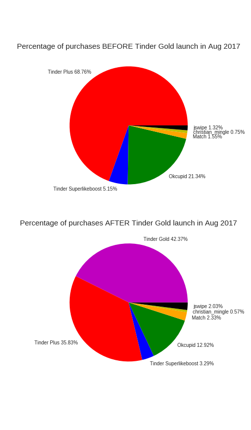
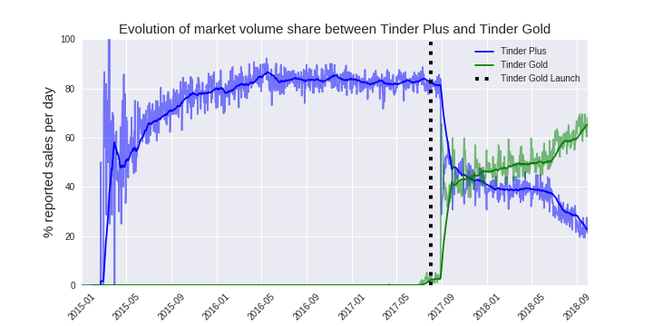
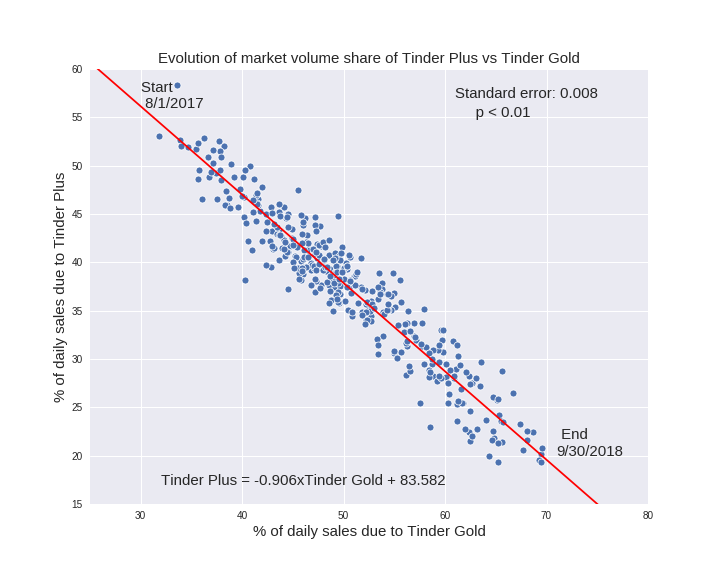
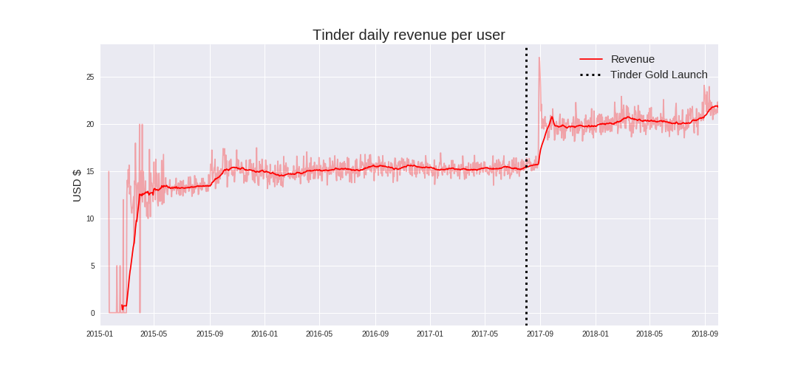
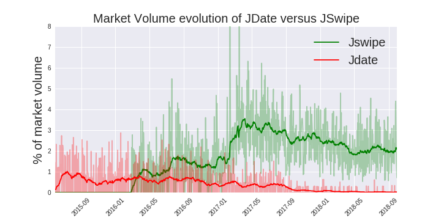

# **Tinder Gold: A big player in the game of dating apps**

April 2019

By [Joe Ganser](mailto:JKGProfessional@gmail.com)

**Abstract**

Tinder Gold was introduced to the dating app market in August 2017. In this data driven study, analysis is made on the impact Tinder Gold had on the other Tinder products and competition from other dating apps. Data records on purchase receipts were used for this analysis. *This presentation is oriented for business developers and does not contain code. For the scientific, code based analysis please go [here](Technical_doc.ipynb).*.

**TABLE OF CONTENTS**
1. [The dating market at a glance](#one)
    * [1.A Tinder Plus versus Tinder Gold](#1.A)     
2. [Introducing the data](#two)
    * [2.A Demographics on the products throughout the cleaned data set](#2.A)
    * [2.B Pie charts of Before and after Tinder Gold launch](#twoB) 
3. [Problem solving strategy](#three3)
    * [3.A Goals of this analysis](#3.A)
4. [Research Results & Key Metrics](#four)
    * [4.A Identifying causality in Market volume changes of Tinder Plus vs Tinder Gold](#4.A)
    * [4.B Evolution of new customer, repeat customers churning customers](#4.B)
    * [4.C Measuring the change in Tinder's revenue per customer](#4.C) 
5. [Anomalies in the data](#five)
    * [5.A An interesting analogy; Jdate vs Jswipe](#fiveA)
6. [Relating the data to user experience studies](#six)
7. [Summary of Conclusions](#seven)
8. [Drawbacks and limitations of the analysis](#8)
9. [Sources](#9)

**1. The Dating Market at a Glance**

Internet dating started in the early 1990s, and in recent years the phenomenon has gone from an awkward subculture to a level of normality seen in popular media. Since the invention of smart phones and tablets, we've seen a renassiance of dating products emerge that take the social paradigms to another level.

Tinder, which started in 2012 (1), has created a level of market dominance that is unprecendented. It's highly addictive smart phone swiping nature has crushed it's competitors and it has gained a major advantage by being one of the first in the market place to boast such features.

Despite there being a functional free version, which allows the possibility of acquiring a partner, people are still willing to pay for all sort of features. It will be clear through this analysis that the more features added to their swipe experience, the more customers are willing to pay.

This analysis intends to examine and measure the impact Tinder's new product, Tinder Gold, had on both the Tinder brand and the dating market.

**1.A Tinder Plus versus Tinder Gold**

Tinder Plus was the original paid version of the app, which allowed users unlimited daily swipes, several "top choice" picks per day. Then came Tinder Gold. Tinder Gold allows for the following features (2):

* Unlimited swipes
* 1 free boost a month
* Control age and distance
* Control who sees you
* Swipe around the world
* 5 super free likes per day
* Unlimited rewinds (go back and swipe again, change your mind)
* No advertisements
* **Seeing who arleady likes you - the only difference between Tinder Plus and Gold**

As we shall see, that one subtle difference made a huge change in multiple metrics of market performance. 

It should also be noted while a Tinder U product does exist, it was not specifically labeled as Tinder U in the Edison Data set. It must have been mixed in by being labeled as one of the other Tinder products.

**2. Introducing the data**

The original raw data source, coming from the data company Edison, consisted of email sales receipts sent to iphone and google play users. The raw data consisted of approximately 1.52 million rows, and after isolating, organizing and cleaning the receipts related to dating apps 324,667 rows were left. These receipts were collected between January 1, 2015 and September 30th, 2018 and consisted of 73,953 unique users. A total revenue of $6.12 Million was measured across the entire data set.

**2.A Demographics on the products throughout the cleaned data set**

The vast majority of the products in the analyzed data set were Tinder related products. There were several other products, and the breakdown across the entire data set can be seen in following table;

[*Table 1*](Technical_doc.ipynb#seven7)

product|Number of unique users|Number of purchases|$revenue
---|---|---|---
Tinder|58803|252672|4.39M
Okcupid|15721|55332|1.01M
Match|6282|6321|417K
twoo|399|1308|10.9K
christian_mingle|1234|2137|104K
elitesingles|384|450|48.8K
jdate|364|789|47.8K
jswipe|1020|5468|92.9K
howaboutwe|109|190|9.32K

Later we shall see the contrast of metrics before and after August 1, 2017, the recognized launch date of Tinder Gold. But to give a simple overview of the contrast, these pie charts describe the percentage of sales (by the number of items sold, not revenue generated) attributed to each product for the two time periods.

**2.B Pie charts of Before and after Tinder Gold launch**

This next figure shows the volume each product took up before and after Tinder Gold's launch. For example, we can say that out of all the instances in the data where a product was purchased before 8/1/2017, 68.76% of it was attributed to Tinder Plus. Look at the changes in percentages between the two pies.

*Figure 1*

*Note* Products such as elitesingles,twoo, howaboutwe, and jdate were omitted because their percentages were very small.

**We arrive at out first conclusions:** Tinder - a dating app based on smart phone swiping - is dominating the dating market. It's difference in market share must be caused by providing a uniquely different user experience from the other dating products.

**3. Problem solving strategy**

The general strategy on how to measure Tinder Gold's impact is approached with a fundamental principles. The idea is that, we can find and compare the performance of each dating product and their competitors based upon a few pieces of information:
* A unique identity of each customer (`user_id`)
* The time stamps of when they made any product purchase (`order_time`)
* Tracking the price they paid (`item_price`)
* Identifying the name of the product they purchased at each instance (`product_description`)

Then putting these data points into a time series, we can track the evolution of products. Using these pieces of information we can engineer a few interesting features which become metrics of evaluation as seen in the goals.

The metrics and conclusions will be scalable - i.e. any metric analyzed should remain the same if we increase the amout of data.

**3.A Goals for this analysis**

Tinder Gold's impact will be measured using the following;

* Determine and measure the changes in several metrics that Tinder Gold's affected. These metrics were;
   * Revenue per number of daily users across time
   * New user acquisitions per day
   * New user acquisitions per number of daily users across time (ratio)
   * Product repurchases per day
   * Product repurchases per number of daily users across time (ratio)
   * Churn instances per day
   * Churn instances per number of daily users across time (ratio)
   * Market volume shared by each product across time
* Identify relationships of causality between changes in metrics.
* Comment on the data by integrating user experience research.

The Tinder products will be evaluated on these metrics, as will Okcupid since it's the only significantly measured competitor in the data.

There will also be tasks that provide;
* Identifying any situations analogous to Tinder Gold's that may be affecting the market.
* Identifying any sampling errors that are hidden within the Edison data set itself.
* Identifying any anomalies in the data.

**4. Research Results & Key Metrics**

In this section I present the key results. There are three fundamental results demonstrating the impact Tinder Gold had on the business, and their insights reinforce each other.

**4.A Causality in changes in market volume of Tinder Plus vs Tinder Gold**

In this next plot, we can see the evolution of market volume of Tinder Plus versus Tinder Gold. Market volume, is defined as the percentage of sales (by number of items sold, not revenue) in the data attributed to any product on a given day. For example, on 8/1/2017 approximately 80% of all the recorded items sold on that date were Tinder Plus products (this includes the monthly, 3 month, 6 month and 12 month versions of each) (3).

*Figure 2: The darker lines are the 30day average, the faint ones are the daily values.*

Below, in Figure 3, we have a scatter of the values in the plot above put against each other, AFTER the Tinder Gold launch date. In the upper left hand corner are the values of the market share of Tinder Plus (y) and Tinder Gold (x) on the Tinder Gold launch date, Aug 1 2017. On the bottom right is the very end of the time series, September 30th, 2018.

*Figure 3: X is the percentage of market volume of Tinder Gold, Y is percentage of market volume of Tinder Plus*

Whats most interesting about this plot is that it that both time series are not in any way altered to become stationary (i.e. to seperate the trend from the noise). These are the actual daily volume values, not averaged ones. Using a statistical test called the [Augmented Dickey Fuller test](https://en.wikipedia.org/wiki/Augmented_Dickey%E2%80%93Fuller_test), we see a cointegration of the two time series. Using the [Granger test](https://en.wikipedia.org/wiki/Granger_causality),we can prove a causality relationship between the growth of Tinder Gold and the atrophy of Tinder Plus. By causality, we mean predictive causality in that we can predict the values of Tinder Gold from the values of Tinder Plus. (6)(7)(8)(13)(14)(15)

**We arrive at our second conclusions**: 
* *The rise in sales of Tinder Gold shares a predictive causality relation (p=0.01) with a 74% drop in market volume of Tinder Plus between Aug 1 2017 and Sept 30th 2018.*
* *This is caused by giving people the ability to know who likes them back on the service (Tinder Gold's advantage).*
* *Market changes in Tinder Plus vs Tinder Gold share a causality relationship upto 17 days prior (p<0.01)*
* *No significant change was seen in Tinder's top competitor, Okcupid, across the launch date. [See technical document for details](Technical_doc.ipynb).*

**4.B Evolution of new customer acquisition, repeat purchases and churn instances**

Using feature engineering, I was able to identify instances in the time series that indicated when a customer made their first purchase of a product, a repeat purchase or a churn purchase (i.e. they didn't buy the same product again for atleast 91 days, one business quarter).

With these data points, I could calculate the number of such instances on a given day and compare it to the number of unique users who made purchases on that same day. i.e. for a given product

*Note that a churn instance may simultaneously be a repeat purchase or a new purchase - but not all three!*

**Justification for these metrics**

These metrics indicate the proprotions of how many customers on a given day made what kind of decision. Whats really interesting is they these metrics can provide evidence of stability in a subscription product. During product stability, the evolution of these ratios have a balance with each other. If a change in these values is noticed, as seen in the churn line of figure 4, it indicates a stimulus.

These metrics are also scalable, and should be approximately the same if we increase the number of users in our data. 

In figure 4 we see the plot of these ratios. So on the Tinder Gold launch date, the ratio of churn (blue) purchases to number of unique users was about 0.3 - meaning if we had 100 unique customers who made purchases on that day, then 30 of those customers made a churn purchase. It then went up to around 0.4 and went even higher towards the end of the series.

*[Figure 4](Technical_doc.ipynb#figure4): Note that the churn line (blue) is supposed to end early, because you want to give atleast one business quarter for identifying a churn. The thicker lines are the 30day averages, the faint ones are the daily fluctuations.*

The change in the blue churn line (see arrow) indicates that for a daily pool of Tinder Plus users, a signficant increase in the fraction of people who churned was noticed after Tinder Gold launched.

By examining the evolution of daily instances of repeat purchases and new purchases of Tinder Plus, we can see a transition there are well.

*Figure 5. These are simply the average daily recorded values of new purchases and repeat purchases of Tinder Plus (not per number of customers ratio). Look at the drop after Tinder Gold launched.*

**We can conclude the following**;
* *Tinder Plus's number of churns per daily customers increased (the daily fraction) by 77% after Tinder Gold [(Figure 4)](#figurefour)*
* *Both Tinder Plus's daily repeat purchases and new purchases (not the ratio metric) dropped by 72% after Tinder Gold launched (Figure 5).*

As for the evolution of these metrics on Tinder Gold post launch, the follwing graph is available.

*[Figure 6](Technical_doc.ipynb#figure6): Note the dates on the horizontal start at the launch of Tinder Gold. The thicker lines represent the 30 day average, and the faint lines are daily fluctuations. Notice how to the lines tends towards an equilibrium in ratios as time evolves, similar to how Tinder Plus (figure 4) was before the launch date.*

**4.C Measuring the change in Tinder's revenue per customer**

Measuring the performance of individual products such as Tinder Gold and Tinder plus are important, but how well is Tinder as a brand doing? How is it changing?

To answer these questions, I decided to calculate a metric that determines the ratio between all the money made by Tinder products on a given day to all the people who purchased Tinder products on that same day;

**Justification for this metric**

This metric is scallable and allows us to draw conclusions about the population we're sampling from. It gives critical insight as to the performance of the brand itsself, and it's evolution shows a comparitive contrast on the before and after effects of Tinder Gold.

*Figure 7: The thick line is the 30day average, the faint ones are the day to day values.*

We can see quite a change in the revenue per customer after Tinder Gold's launch. Considering the conclusion previously drawn that Tinder Gold caused a change in market volume of Tinder Plus, we can use Occam's razor to conclude that Tinder Gold also caused the increase in revenue seen here (otherwise, we'd have to assume something else caused it).

**We can draw the following conclusion:**
* *Tinder Gold caused a 42% increase in daily revenue for all Tinder products combined (between 8/1/2017 and 9/30/2018).*
* *Before Tinder Gold, Tinder's CAGR (compounded annual growth rate) was 8.98%. After Tinder Gold, Tinder's CAGR was 17.2%*
    * *Tinder Gold improved Tinder's CAGR by 91.2%*
* *Tinder Gold took Tinder Plus's customers, and despite a decrease in sales of Tinder Plus, the overall sales of Tinder products increased.*
* *Okcupid's revenue per customer was evaluated as well, but the results did not indicate significant changes from the Tinder Gold launch. [See the technical documents for those details](Technical_doc.ipynb#Okcupid_revenue).*

**5. Anomalies and Suprising things in the data**

There were four anomalies in the data to be noted. One situation which is relevant to this presentation demonstrates a somewhat analogous situation to Tinder Gold's growth. [The other anomalies can be found in the technical document](Technical_doc.ipynb#anomalies).

**5A.An analogy to Tinder vs the rest of the market: JDate vs JSwipe**

JDate and JSwipe make for an interesting sub study on the effects that swipe based dating apps have on people. Because these apps are oriented to a smaller cultural subset, we can see an example somewhat isolated from the general population on the effects that swipe based dating apps have on the market.

Here in figure 8 we see the market volume evolution of JDate and JSwipe across Time. Clearly this suggests a pattern - as swipe based dating apps are introduced, they go up in market volume and their direct competitors drop.

*Figure 8*

**6. Relating the data to user experience studies**

Considering the overwhelmingly obvious data that Tinder is dominating the dating sphere, it suggests that it’s providing something different from the other dating products.

There is a bit of an irony in some user experience surveys. In one study on almost 9,761 college aged users who’d been on the app for at least six months, 70% of them reported they had not actually met anyone through the app (10,11). You’d think that a product would be popular because it’s achieving the result it’s advertised for, but in the artificial world of social media this doesn’t seem to be the case.

What does seem to be the case is that users see Tinder more as a source of entertainment, and as a source confidence boosting/social validation. In that same user experience study, 45% of users said they were doing it for confidence boosting, and only 25% said they were seeking a partner (10,11).  Moreover, in consideration of the widely known axiom that social media is highly addictive, it’s pretty easy to call Tinder addictive with every swipe diminishing the user’s attention span. This could partially explain the major market volume gap between Tinder and its competition.

Contrasting against the competition, we see that steadily popular dating sites such as Match.com actually offer money back guarantees for finding romantic partners (12). Such a bold offer could only be sustained if it was backed up its results. Yet Tinder sells more, is growing faster but rarely gets people what it’s advertised for(10,11).

In reflection, one could conclude that a social media product will sell more than its competitors if it’s designed to be more addictive and provides a myriad of psycho-social stimulation. Move over, it will do so even if it doesn’t get the users the advertised result they had hoped for as often as a less stimulating product. 

**7. Summarizing the conclusions**

As mentioned in section 1.B, the fundamental difference between Tinder Gold and Tinder Plus was the Tinder Gold allowed users to see who liked them back. This one feature made a world of difference in the dating market, because it focuses in on a pscyhological anticipation factor that users really desire.

In all we can draw the following conclusions:
* Smart phone swipe based dating apps are dominating the dating app market.
* Tinder Gold's distinct advantage caused a significant drop in the market share of Tinder Plus
* Tinder Gold caused an increase in Tinder Plus's churns.
* Tinder Gold didn't make signficantly measurable changes in the volume/revenue of Okcupid.
* Tinder Gold caused a 42% increase in the Tinder brand's revenue per customer, and is responsible for a 17.2% CAGR
* Tinder Gold is providing a fundamentally different kind of user experience from other dating apps.
* The right feature, added at the right time, can change the entire market. Sometimes all it takes is a subtle change. In the dating app market, this particularly applies when we tap into the human needs of social validation.

*Quod Erat Demonstrandum*

**8. Draw backs and Limitations of the Analysis**

As with any analysis there are things that limit our analysis and make sensitive to errors. For this project, a few of these were;
* The conclusions reinforce each other; if one conclusion is wrong it draws into question the other conclusions.
* The source data may have been subject to a collection bias towards Tinder products.
* Bumble, a major competitor to Tinder, was not included in the raw data.
* There is a lot of misinformation on the product prices. Prices of dating products changed periodically throughout the time period studied and there isn't consistent information as to when these changes happened.

**9. Sources**

[1] Tinder’s history  https://en.wikipedia.org/wiki/Tinder_(app)

[2] ‘Tinder Plus versus Tinder Gold’: https://www.help.tinder.com/hc/en-us/articles/115004487406-Tinder-Plus-and-Tinder-Gold-

[3] Tinder Prices on the app store:  https://itunes.apple.com/us/app/tinder/id547702041?mt=8

[4] Okcupid Prices https://itunes.apple.com/us/app/okcupid-online-dating-app/id338701294?mt=8

[5] Match.com prices https://itunes.apple.com/us/app/match-1-dating/id305939712?mt=8

[6] Stationarity in time series: https://www.analyticsvidhya.com/blog/2018/09/non-stationary-time-series-python/

[7] Cointegration of time series: http://www.eco.uc3m.es/~jgonzalo/teaching/EconometriaII/cointegration.HTM

[8] Granger Causality  https://www.statisticshowto.datasciencecentral.com/granger-causality/

[9] Welch’s t-test:  https://en.wikipedia.org/wiki/Welch%27s_t-test

[10] Here's the Real Reason Why Millennials Use Tinder http://money.com/money/4713971/tinder-millennials-dating-apps/

[11] LendEdus Tinder study https://lendedu.com/blog/tinder-match-millennials/

[12] Match.coms guarantee https://www.match.com/guarantee/rules.aspx

[13] Augmented Dickey Fuller Test https://en.wikipedia.org/wiki/Augmented_Dickey%E2%80%93Fuller_test

[14] Granger Causality https://en.wikipedia.org/wiki/Granger_causality

[15] Granger Test for Python https://www.statsmodels.org/dev/generated/statsmodels.tsa.stattools.grangercausalitytests.html

